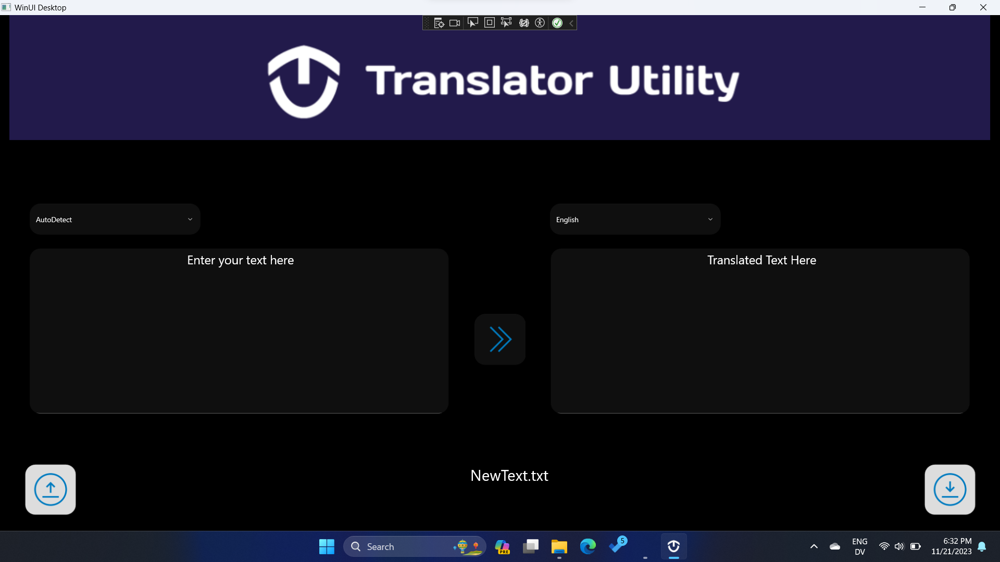
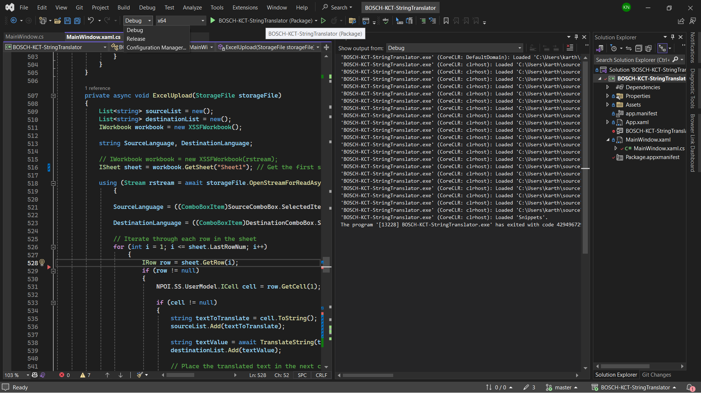

# KCT-BSGW Translation Utility built with .NET and AzureSQL

This project is a collaboration between a myself, a student of Kumaraguru Collage of Technology and Bosch Global Software Technologies. The aim is to create a Windows application using WinUI3 that can accept a text file, word file, excel file, or raw text string from the user and translate it using Microsoft Azure Translate. The translated file is then generated by the application. 

A Microsoft SQL database is connected to the application to increase the efficiency of translation by storing previous translations. The ultimate goal is to create a database that covers translations for most Automotive Aftermath Manuals. This prototype will eventually be implemented in the industry by creating a web application and hosting it on Microsoft Azure, along with the database for storing translations.

<div align="center">

  

  ### Complete documentantion 
  [KCT - BGSW_Translate Utility Project Report 2.1](https://1drv.ms/w/s!AlCg_DrCVNeDhizmId2EV1gARVlj?e=EYyXcm)
</div>

## Development Environment
The application is a C# .NET project with a Windows UI Library (WinUI) 3 user interface (UI), created using Visual Studio.

### Prerequisites
- [Visual Studio Community 2022](https://visualstudio.microsoft.com/downloads/?cid=learn-onpage-download-cta) (recommended) or Visual Studio 2019.
- [SQL Server Management Studio (SSMS)](https://learn.microsoft.com/en-us/sql/ssms/download-sql-server-management-studio-ssms?view=sql-server-ver16)
- Tools for the Windows App SDK. Install using the following command:
```
winget install "Visual Studio Community 2022"  --override "--add Microsoft.VisualStudio.Workload.ManagedDesktop Microsoft.VisualStudio.ComponentGroup.WindowsAppSDK.Cs" -s msstore
```

### 1. Install Release Package ( placeholder api key - translation won't work )


### 2. Build and Debug
1. Clone the repository using
```
git clone https://github.com/KarthiDreamr/MultiFile_AzureTranslate_WindowsApp.git
```
2. The `App.xaml` file and code-behind file(s) define an `Application`-derived class that represents your running app. The `MainWindow.xaml` file and code-behind file(s) define a `MainWindow` class that represents the main window displayed by your app. These classes derive from types in the `Microsoft.UI.Xaml` namespace provided by WinUI 3.
3. Replace the placeholder key in the MainWindow.xaml.cs with your Azure Translate instance key.
4. Press the run button after selecting debugging or release build as you needed.

<div style="text-align: center;">
  
  
</div>
